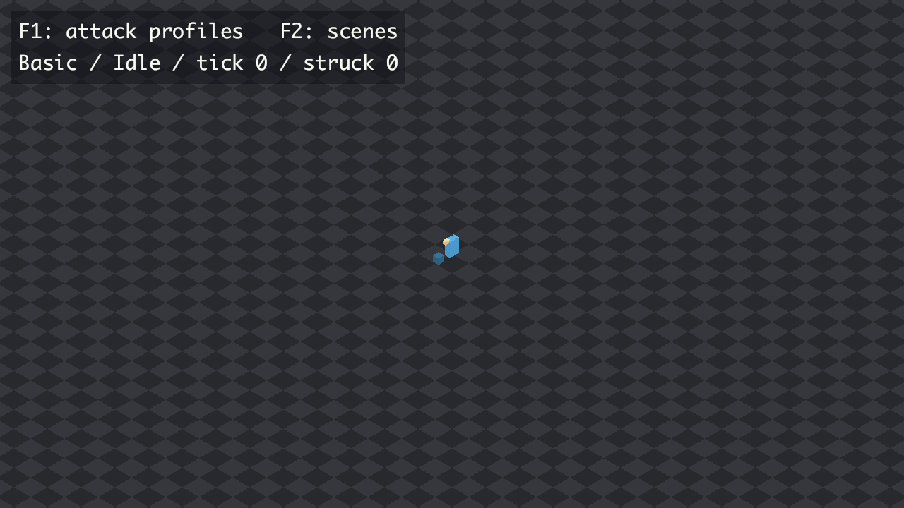
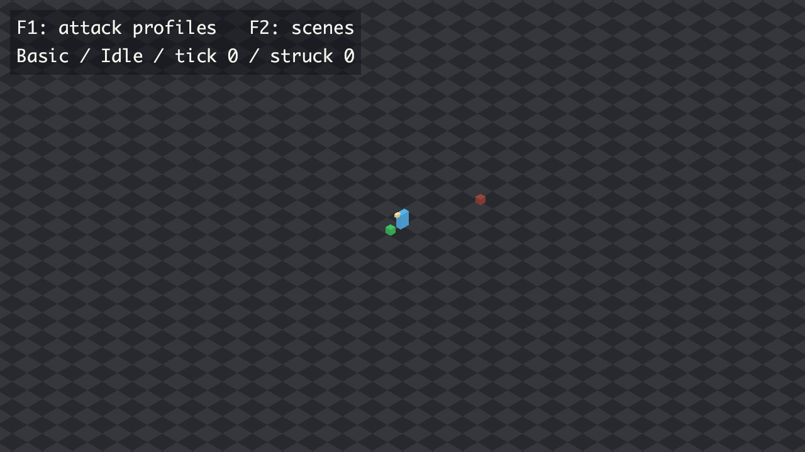

# Activate the horde

Open **F2**, select **activate_horde.ron**, and press **Enter**. Press **E**
beside the blue block. It turns green once, and seekers begin approaching.
Move with WASD and swing with Space. E does not toggle the source off.
**F2 → Restart current** restores the blue block and empty arena.

The authored scene is [activate_horde.ron](../scenes/activate_horde.ron).
The fast architecture fixtures are inline in the source-control regression
scenarios.

| Setting | Purpose |
|---|---|
| Control at (0, 1.2) metres | Within the starting 1.5 m interaction reach, visibly separate from the player |
| Source centred at (0, −8), radius 2.5 metres | Approach is visible at the default camera zoom and begins away from the player |
| One seeker every 45 ticks / 0.75 seconds | Staggers arrivals so activation and approach can be seen |
| Population gate of eight enemies | Keeps the trial small and replenishes defeated enemies; the prop does not count |

## Durable verification

[activate_horde_trial.ron](../scenarios/activate_horde_trial.ron) loads the same
scene file and asserts:

- No enemies during the first two seconds, with the control still Ready.
- Activation on tick 120, no same-tick spawn, and first emission on tick 121.
- Subsequent cadence boundaries and the eighth arrival on tick 436.
- Eight seekers, then no extra emissions while the population gate is closed.
- A removed enemy permits immediate refill once cadence is ready; its retired
  identity stays dead, and the control remains activated.

The refill scenario removes an enemy directly to pin the gate's timing.
Combat damage and defeat have separate engine scenarios.

## Live verification — 2026-09-11

Tested a release build on Apple M4 / Metal with vsync, using only the engine
harness for input, state, trace, and screenshots. Selected the new file through
F2. The captured views show an empty arena with a blue control, followed by
the green control and the first approaching enemy.

